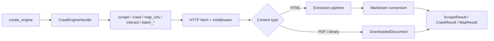

# Architecture

Kreuzcrawl is a Rust core crate (`kreuzcrawl`) with a small public surface, surrounded by polyglot bindings that all wrap the same core. The runtime is Tokio; HTTP fetching uses `reqwest`; browser-backed rendering and interaction can use either the chromiumoxide CDP backend or the in-process native backend.

## Public surface

The crate root exports seven free functions over an opaque handle, plus serialisable configuration and result types:

| Symbol                                                                                | Purpose                                                      |
| ------------------------------------------------------------------------------------- | ------------------------------------------------------------ |
| `create_engine(config: Option<CrawlConfig>) -> Result<CrawlEngineHandle, CrawlError>` | Build an engine from a validated `CrawlConfig`.              |
| `scrape(&engine, url) -> Result<ScrapeResult, _>`                                     | Fetch and extract a single page.                             |
| `crawl(&engine, url) -> Result<CrawlResult, _>`                                       | Follow links from a seed up to `max_depth` / `max_pages`.    |
| `map_urls(&engine, url) -> Result<MapResult, _>`                                      | Discover URLs via sitemaps and link extraction.              |
| `interact(&engine, url, actions) -> Result<InteractionResult, _>`                     | Navigate once and run ordered page actions.                  |
| `batch_scrape(&engine, urls) -> Result<Vec<BatchScrapeResult>, _>`                    | Scrape many URLs concurrently.                               |
| `batch_crawl(&engine, urls) -> Result<Vec<BatchCrawlResult>, _>`                      | Crawl many seeds concurrently.                               |
| `serve_api(...)` (feature `api`) / `start_mcp_server(...)` (feature `mcp`)            | Long-running REST and MCP servers backed by the same engine. |

All other items in the source tree are internal — the public crate surface is intentionally narrow.

## Data flow

The middleware stack between the engine and the network applies per-domain rate limiting, conditional caching, and User-Agent rotation, plus optional `tracing` spans. WAF responses can trigger an automatic browser fallback when `BrowserMode::Auto` is set. `interact()` bypasses the crawl/extraction pipeline and keeps one browser page open while it executes `PageAction` values such as click, type, wait, screenshot, JavaScript evaluation, and scrape. Chromiumoxide supports the full action set; the native backend supports DOM/JS actions and reports screenshot actions as unsupported because it has no visual layout renderer. The extraction pipeline is described in detail in [Content Extraction](content-extraction.md).

## Bindings

Every binding consumes the same Rust core via FFI. The per-binding glue is generated by [alef](https://github.com/kreuzberg-dev/alef) from the core types and a binding manifest (`alef.toml`); generated code lives under `packages/<lang>/` and `crates/kreuzcrawl-<binding>/`. Binding-level differences (async runtimes, naming conventions, type marshalling) are handled by the generator — the core itself stays language-agnostic.

| Binding crate                | Distribution                                                | Mechanism                 |
| ---------------------------- | ----------------------------------------------------------- | ------------------------- |
| `crates/kreuzcrawl-py`       | PyPI `kreuzcrawl`                                           | PyO3 + maturin            |
| `crates/kreuzcrawl-node`     | npm `@kreuzberg/kreuzcrawl`                                 | NAPI-RS                   |
| `crates/kreuzcrawl-php`      | Composer `kreuzberg-dev/kreuzcrawl`                         | ext-php-rs                |
| `crates/kreuzcrawl-wasm`     | npm `@kreuzberg/kreuzcrawl-wasm`                            | wasm-bindgen              |
| `crates/kreuzcrawl-ffi`      | Shared library + cbindgen header                            | C FFI                     |
| `packages/ruby/ext/...`      | RubyGems `kreuzcrawl`                                       | Magnus + rb-sys           |
| `packages/elixir/native/...` | Hex `kreuzcrawl`                                            | Rustler NIF               |
| `packages/go`                | Go module `github.com/kreuzberg-dev/kreuzcrawl/packages/go` | cgo over C FFI            |
| `packages/java`              | Maven Central `dev.kreuzberg.kreuzcrawl:kreuzcrawl`         | Java 25 Panama FFM        |
| `packages/kotlin-android`    | Maven Central `dev.kreuzberg.kreuzcrawl:kreuzcrawl-android` | Android AAR with JNI .sos |
| `packages/csharp`            | NuGet `Kreuzcrawl`                                          | .NET 10 P/Invoke          |
| `packages/dart`              | pub.dev `kreuzcrawl`                                        | Dart FFI                  |
| `packages/swift`             | Swift Package Manager                                       | Swift over C FFI          |
| `packages/zig`               | `zig fetch --save`                                          | Zig over C FFI            |

## Feature gates

Cargo features keep the default build minimal — the default feature set is empty. The user-facing features are:

| Feature          | Capability                                                                                  |
| ---------------- | ------------------------------------------------------------------------------------------- |
| `browser`        | Headless-Chrome fallback for JS-heavy or WAF-protected pages.                               |
| `browser-native` | In-process native browser backend for rendering and page interaction.                       |
| `interact`       | Compatibility alias for browser-backed page interaction. The public API is always compiled. |
| `tracing`        | OpenTelemetry-compatible request spans.                                                     |
| `api`            | `serve_api(...)` — Firecrawl v1-compatible REST server.                                     |
| `mcp`            | `start_mcp_server(...)` — Model Context Protocol server for AI-agent integration.           |
| `mcp-http`       | MCP over HTTP transport (implies `mcp` + `api`).                                            |
| `warc`           | WARC 1.1 output via `CrawlConfig::warc_output`.                                             |
