# Architecture

Kreuzcrawl is a Rust crawling engine that turns websites into structured data. It is built around a trait-based plugin system composed through a Tower middleware stack, with optional feature gates for browser rendering, AI extraction, MCP integration, and more.

## High-Level Data Flow

```mermaid
graph LR
    A[CrawlEngine] --> B[Tower Stack]
    B --> C[Per-Domain Rate Limit]
    C --> D[HTTP Cache]
    D --> E[UA Rotation]
    E --> F[HTTP Fetch]
    F --> G[Response]
    G --> H[HTML Extraction]
    H --> I[Markdown Conversion]
    I --> J[Content Filter]
    J --> K[CrawlStore]
```



A request flows through the engine as follows:

1. **CrawlEngine** receives a URL (via `scrape`, `crawl`, or `map`).
2. The **Tower service stack** processes the HTTP request through composable middleware layers.
3. The raw HTTP response is parsed and fed into the **extraction pipeline** (metadata, links, images, feeds, JSON-LD).
4. The HTML body is converted to **Markdown** (always-on, via `html-to-markdown-rs`).
5. A **content filter** (e.g., BM25 relevance scoring) decides whether to keep or discard the page.
6. Results are persisted through the **CrawlStore** trait and events are emitted via **EventEmitter**.

## Trait-Based Design

The engine is composed of seven pluggable trait objects, each held behind `Arc<dyn Trait>`:

| Trait | Responsibility | Default Implementation |
|-------|---------------|----------------------|
| `Frontier` | URL queue and deduplication | `InMemoryFrontier` (VecDeque + AHashSet) |
| `RateLimiter` | Per-domain request throttling | `PerDomainThrottle` (200ms default delay) |
| `CrawlStore` | Persistence for crawl results | `NoopStore` (discards all data) |
| `EventEmitter` | Crawl lifecycle event hooks | `NoopEmitter` (silent) |
| `CrawlStrategy` | URL selection and scoring | `BfsStrategy` (breadth-first) |
| `ContentFilter` | Post-extraction page filtering | `NoopFilter` (pass-through) |
| `CrawlCache` | HTTP response caching | `NoopCache` (no caching) |

All traits are `Send + Sync` and use `async_trait` (except `CrawlStrategy`, which is synchronous).

!!! warning "Default implementations are internal"
    The types named in the "Default Implementation" column (`InMemoryFrontier`, `PerDomainThrottle`, `BfsStrategy`, etc.) live in the `defaults` module, which is `pub(crate)`. You cannot import them directly. To use the defaults, call `create_engine(config)` — it wires up all seven traits automatically. If you need a custom implementation, implement the relevant trait on your own type and pass it through the builder (see the [configuration guide](../guides/configuration.md#builder-pattern)).

## Builder Pattern

`CrawlEngine` is constructed exclusively through `CrawlEngineBuilder`. Any trait left unset is filled with its default implementation:

```rust
// create_engine is the public path — it calls builder() with default trait implementations.
let engine = create_engine(Some(config))?;
```

For the uncommon case of injecting custom trait implementations, the internal builder is only reachable from within this crate (e.g. as a workspace member or fork). External projects cannot inject custom trait implementations until the relevant items are re-exported.

The builder calls `config.validate()` before constructing the engine and returns `Result<CrawlEngine, CrawlError>`.

## Tower Service Stack

The HTTP fetch pipeline is a Tower `Service<CrawlRequest, Response = CrawlResponse, Error = CrawlError>` built from composable layers. The stack is constructed in `CrawlEngine::build_service` with the following layer order (outermost to innermost):

1. `CrawlTracingLayer` -- emits `tracing` spans with OpenTelemetry-compatible fields (feature-gated behind `tracing`)
2. `PerDomainRateLimitLayer` -- delegates to the `RateLimiter` trait for per-domain throttling
3. `CrawlCacheLayer` -- checks/stores responses through the `CrawlCache` trait
4. `UaRotationLayer` -- round-robin User-Agent header injection
5. `HttpFetchService` -- the innermost service performing the actual `reqwest` HTTP call with retry logic

## Feature Gates

Kreuzcrawl uses Cargo feature flags to keep the default build minimal:

| Feature | Dependencies | Capability |
|---------|-------------|------------|
| `browser` | `chromiumoxide` | Headless browser rendering for JS-heavy pages |
| `ai` | `liter-llm`, `minijinja` | LLM-powered structured data extraction |
| `tracing` | `tracing` | OpenTelemetry-compatible request tracing |
| `interact` | `chromiumoxide` (implies `browser`) | Page interaction actions (click, type, scroll) |
| `mcp` | `rmcp`, `schemars` | Model Context Protocol server |
| `api` | `axum`, `tower-http`, `utoipa`, `uuid`, `dashmap`, `base64` | REST API server with OpenAPI docs |
| `mcp-http` | (implies `mcp` + `api`) | MCP over HTTP transport |
| `warc` | `uuid` | WARC archive output format |

The default feature set is empty -- no optional dependencies are included unless explicitly enabled.

## Crate Structure

```text
crates/kreuzcrawl/src/
    engine/          -- CrawlEngine, builder, crawl loop orchestration
    tower/           -- Tower service stack (rate limit, cache, UA rotation, tracing)
    traits.rs        -- 7 pluggable trait definitions
    defaults/        -- Default implementations for all traits
    html/            -- HTML parsing, metadata, links, images, feeds, JSON-LD
    markdown.rs      -- HTML-to-Markdown conversion
    citations.rs     -- Citation extraction from markdown
    pruning.rs       -- "Fit content" markdown pruning
    normalize.rs     -- URL normalization and deduplication
    robots.rs        -- robots.txt parsing and path matching
    scrape.rs        -- Single-page scrape pipeline
    map.rs           -- Site map discovery
    error.rs         -- CrawlError enum with thiserror
    types/           -- CrawlConfig, ScrapeResult, PageMetadata, etc.
```
